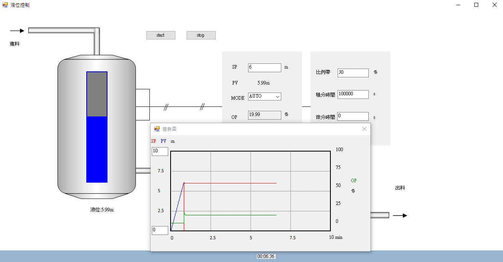

# 電腦模擬液位控制系統
 
 
   
 
工業控制器的控制作用是將由測量原件測得的程序變數與其本身的定點比較得誤差 ε，依此誤差經一定的函數關係發出一信號至最後控制原件，以期程序達到所要的控制點而保持在穩態，產生此種控制作用的特殊方法稱為控制方式。

本專案以比例積分微分控制(Proportional Integral Derivative Control，PID)，根據系統的誤差利用比例、積分、微分計算出控制量，模擬液槽中液位變化。

# 使用說明

## 控制模式
### 手動模式(MAN)

手動控制閥開度(OP)：0 ~ 100%(閥全開)，以調整槽內液體累積量  

PV：液位值  
OP增加，PV下降  

### 自動模式(AUTO)

輸入設定點(SP)以控制液位在固定值  
自動動控制閥開度(OP)：0 ~ 100%(閥全開)，以調整槽內液體累積量  

# 安裝須知

1. 確認電腦已安裝[**Microsoft .NET Framework**](https://www.microsoft.com/zh-tw/download/details.aspx?id=30653)
2. 下載[**PIDcontrol.exe**](https://github.com/kkbox2468/PIDcontrol/blob/master/PIDcontrol/bin/Debug/PIDcontrol.exe)
